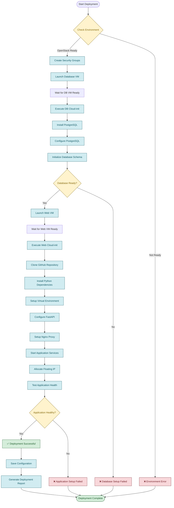

# OpenStack Cloud Application - Deployment Flow

## Deployment Process Diagram

## Detailed Deployment Steps

### Phase 1: Environment Preparation
1. **Source OpenStack Credentials**
   - Load `cloud_app-openrc.sh`
   - Verify OpenStack CLI access

2. **Create Security Groups**
   - Web Security Group (ports 80, 8000, 22, ICMP)
   - Database Security Group (ports 5432, 22, ICMP)

### Phase 2: Database Server Deployment
3. **Launch Database VM**
   - Image: Ubuntu 20.04
   - Flavor: m1.small (2 vCPU, 4GB RAM)
   - Network: app_net (private)
   - Security Group: db-security-group

4. **Execute Cloud-init Script**
   - Install PostgreSQL 14
   - Configure database settings
   - Create database and user
   - Initialize schema with sample data

### Phase 3: Web Server Deployment
5. **Launch Web VM**
   - Image: Ubuntu 20.04
   - Flavor: m1.small (2 vCPU, 4GB RAM)
   - Network: app_net (private)
   - Security Group: web-security-group

6. **Execute Cloud-init Script**
   - Clone GitHub repository
   - Install Python 3.8+ and dependencies
   - Setup virtual environment
   - Configure FastAPI application
   - Setup Nginx proxy
   - Start systemd services

### Phase 4: Network Configuration
7. **Allocate Floating IP**
   - Assign public IP to web server
   - Configure routing

8. **Test Connectivity**
   - Verify database connection
   - Test application health endpoint
   - Validate API endpoints

### Phase 5: Verification & Documentation
9. **Health Checks**
   - Application status: `/health`
   - Database connectivity
   - API functionality: `/api/users`, `/api/posts`
   - Documentation: `/docs`

10. **Generate Reports**
    - Save configuration to `config.env`
    - Create deployment log
    - Document IP addresses and access details

## Deployment Timeline

| Phase | Duration | Description |
|-------|----------|-------------|
| Environment Setup | 2-3 min | Security groups, network verification |
| Database Deployment | 5-7 min | VM launch, PostgreSQL installation |
| Web Server Deployment | 8-10 min | VM launch, application setup |
| Network Configuration | 2-3 min | Floating IP allocation |
| Testing & Verification | 3-5 min | Health checks, API testing |
| **Total** | **20-28 min** | Complete deployment |

## Rollback Strategy

If deployment fails at any stage:

1. **Clean up resources** using `./cleanup.sh`
2. **Check logs** for specific error messages
3. **Verify OpenStack environment** and credentials
4. **Retry deployment** with `./deploy.sh`

## Success Criteria

- ✅ Both VMs are running and accessible
- ✅ Database server accepts connections on port 5432
- ✅ Web server responds on port 80 and 8000
- ✅ Application health endpoint returns status "healthy"
- ✅ Database connection shows "OK" in health check
- ✅ API endpoints return valid JSON responses
- ✅ Floating IP is accessible from external network 