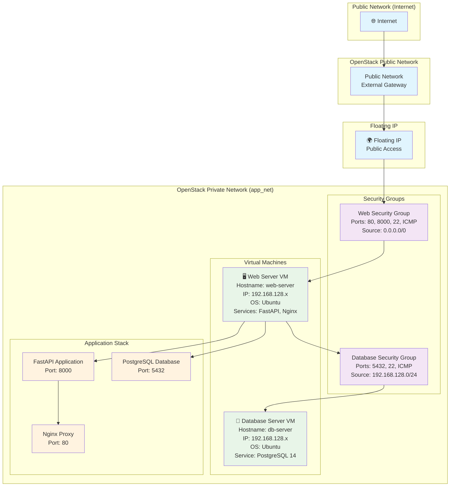

# OpenStack Cloud Application - Network Architecture

## Network Topology Diagram

## Security Groups Configuration

### Web Server Security Group
- **Name:** `web-security-group`
- **Description:** Security group for web server
- **Rules:**
  - TCP Port 80 (HTTP) - Source: 0.0.0.0/0
  - TCP Port 8000 (FastAPI) - Source: 0.0.0.0/0
  - TCP Port 22 (SSH) - Source: 0.0.0.0/0
  - ICMP (Ping) - Source: 0.0.0.0/0

### Database Server Security Group
- **Name:** `db-security-group`
- **Description:** Security group for database server
- **Rules:**
  - TCP Port 5432 (PostgreSQL) - Source: 192.168.128.0/24
  - TCP Port 22 (SSH) - Source: 192.168.128.0/24
  - ICMP (Ping) - Source: 192.168.128.0/24

## Network Flow

1. **External Access:** Internet → Public Network → Floating IP → Web Server
2. **Internal Communication:** Web Server → Database Server (via private network)
3. **Load Balancing:** Nginx (Port 80) → FastAPI (Port 8000)
4. **Database Access:** FastAPI → PostgreSQL (Port 5432)

## IP Addressing Scheme

- **Public Network:** External gateway provided by OpenStack
- **Private Network:** 192.168.128.0/24
- **Web Server:** 192.168.128.x (dynamically assigned)
- **Database Server:** 192.168.128.x (dynamically assigned)
- **Floating IP:** Public IP (dynamically allocated) 