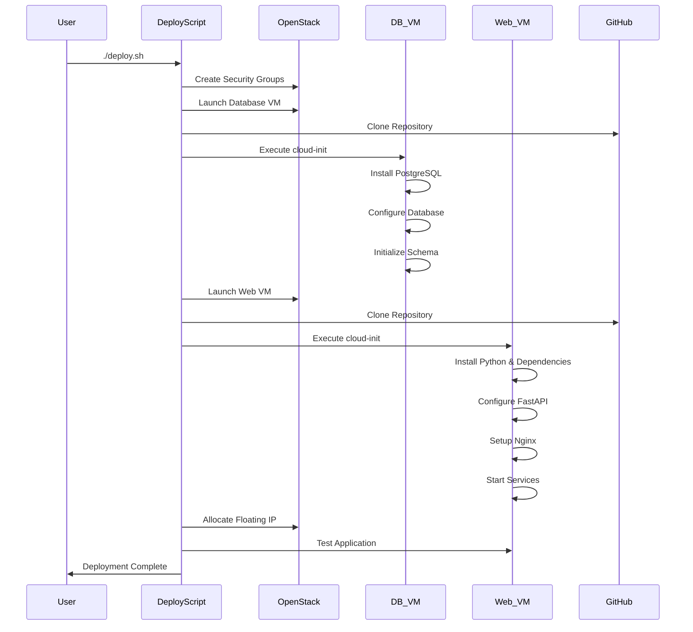

# OpenStack Cloud Application - System Architecture

## Application Architecture Diagram

```mermaid
graph TB
    subgraph "Client Layer"
        BROWSER[🌐 Web Browser]
        API_CLIENT[📱 API Client]
        SSH_CLIENT[🔧 SSH Client]
    end
    
    subgraph "Load Balancer & Proxy"
        NGINX[Nginx Proxy Server<br/>Port: 80<br/>SSL Termination<br/>Static Files]
    end
    
    subgraph "Application Layer"
        FASTAPI[FastAPI Application<br/>Port: 8000<br/>Python 3.8+<br/>Uvicorn Server]
        
        subgraph "API Endpoints"
            HEALTH[/health<br/>System Status]
            USERS[/api/users<br/>User Management]
            POSTS[/api/posts<br/>Content Management]
            STATS[/api/stats<br/>System Metrics]
            DOCS[/docs<br/>API Documentation]
        end
    end
    
    subgraph "Data Layer"
        POSTGRES[(PostgreSQL 14<br/>Database Server<br/>Port: 5432)]
        
        subgraph "Database Schema"
            USERS_TABLE[users<br/>id, username, email, created_at]
            POSTS_TABLE[posts<br/>id, user_id, title, content, created_at]
        end
    end
    
    subgraph "Infrastructure Layer"
        WEB_VM[🖥️ Web Server VM<br/>Ubuntu 20.04<br/>m1.small Flavor<br/>2 vCPU, 4GB RAM]
        DB_VM[💾 Database VM<br/>Ubuntu 20.04<br/>m1.small Flavor<br/>2 vCPU, 4GB RAM]
    end
    
    subgraph "Monitoring & Management"
        MONITORING[📊 Monitoring Scripts<br/>CPU, Memory, Disk<br/>Network I/O]
        COST_ANALYSIS[💰 Cost Analysis<br/>Resource Usage<br/>Cost Calculation]
        CLOUD_INIT[⚙️ Cloud-init Scripts<br/>Automated Setup<br/>Configuration]
    end
    
    subgraph "OpenStack Infrastructure"
        OPENSTACK[☁️ OpenStack Cloud<br/>Compute, Network<br/>Storage, Identity]
        
        subgraph "Security Groups"
            WEB_SG[Web Security Group<br/>Ports: 80, 8000, 22]
            DB_SG[DB Security Group<br/>Ports: 5432, 22]
        end
        
        subgraph "Networking"
            PRIVATE_NET[Private Network<br/>192.168.128.0/24]
            FLOATING_IP[Floating IP<br/>Public Access]
        end
    end
    
    %% Client connections
    BROWSER --> NGINX
    API_CLIENT --> NGINX
    SSH_CLIENT --> FLOATING_IP
    
    %% Application flow
    NGINX --> FASTAPI
    FASTAPI --> HEALTH
    FASTAPI --> USERS
    FASTAPI --> POSTS
    FASTAPI --> STATS
    FASTAPI --> DOCS
    
    %% Data flow
    FASTAPI --> POSTGRES
    POSTGRES --> USERS_TABLE
    POSTGRES --> POSTS_TABLE
    
    %% Infrastructure mapping
    NGINX --> WEB_VM
    FASTAPI --> WEB_VM
    POSTGRES --> DB_VM
    
    %% Monitoring connections
    MONITORING --> WEB_VM
    MONITORING --> DB_VM
    COST_ANALYSIS --> OPENSTACK
    
    %% OpenStack components
    WEB_VM --> WEB_SG
    DB_VM --> DB_SG
    WEB_VM --> PRIVATE_NET
    DB_VM --> PRIVATE_NET
    FLOATING_IP --> WEB_VM
    
    %% Styling
    classDef client fill:#e3f2fd
    classDef app fill:#f1f8e9
    classDef data fill:#fff3e0
    classDef infra fill:#fce4ec
    classDef monitoring fill:#f3e5f5
    classDef openstack fill:#e0f2f1
    
    class BROWSER,API_CLIENT,SSH_CLIENT client
    class NGINX,FASTAPI,HEALTH,USERS,POSTS,STATS,DOCS app
    class POSTGRES,USERS_TABLE,POSTS_TABLE data
    class WEB_VM,DB_VM infra
    class MONITORING,COST_ANALYSIS,CLOUD_INIT monitoring
    class OPENSTACK,WEB_SG,DB_SG,PRIVATE_NET,FLOATING_IP openstack
```

## Deployment Architecture



## Technology Stack

### Frontend & API
- **Framework:** FastAPI (Python 3.8+)
- **Server:** Uvicorn ASGI Server
- **Proxy:** Nginx (Load Balancer & Static Files)
- **Documentation:** Auto-generated OpenAPI/Swagger

### Database
- **Database:** PostgreSQL 14
- **Connection Pool:** psycopg2
- **Schema:** Users and Posts tables

### Infrastructure
- **Cloud Platform:** OpenStack
- **Virtualization:** KVM/QEMU
- **Operating System:** Ubuntu 20.04 LTS
- **Flavor:** m1.small (2 vCPU, 4GB RAM)

### Automation & Monitoring
- **Configuration Management:** Cloud-init
- **Process Management:** Systemd
- **Monitoring:** Custom Python scripts
- **Cost Analysis:** Resource usage tracking

### Security
- **Network Security:** OpenStack Security Groups
- **Access Control:** SSH key-based authentication
- **Database Security:** Network isolation (private subnet)
- **Application Security:** Input validation, SQL injection protection

## Data Flow

1. **Client Request:** Browser/API client → Floating IP
2. **Load Balancing:** Nginx receives request on port 80
3. **Application Processing:** FastAPI handles business logic
4. **Database Query:** PostgreSQL executes queries
5. **Response:** Data flows back through the stack
6. **Monitoring:** System metrics collected continuously

## Scalability Considerations

- **Horizontal Scaling:** Multiple web servers behind load balancer
- **Database Scaling:** Read replicas for read-heavy workloads
- **Caching:** Redis for session and data caching
- **CDN:** Static content delivery optimization 